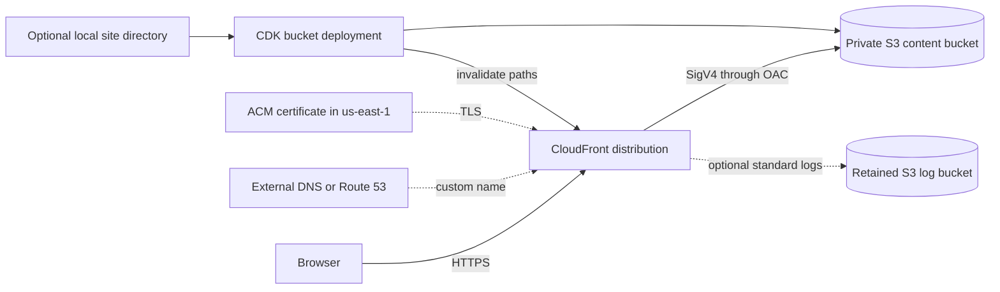

# Architecture

`aws-cdk-static-site` is a Python AWS CDK v2 library exposing one reusable L3 construct. It composes
secure static-site delivery resources inside a consumer-owned CDK stack; it is not a standalone
deployment application.

- [System Context](#system-context)
- [Resource Model](#resource-model)
- [Request and Deployment Flows](#request-and-deployment-flows)
- [Optional Integrations](#optional-integrations)
- [Security and Lifecycle](#security-and-lifecycle)
- [Repository Architecture](#repository-architecture)
- [Automation Architecture](#automation-architecture)
- [Change Impact and Sources of Truth](#change-impact-and-sources-of-truth)
- [Known Boundaries](#known-boundaries)

## System Context



The package owns the delivery resources shown above. The consuming application owns the CDK app, AWS
environment, tags and outputs, website content decisions, deployment identity, budgets, monitoring,
and application APIs.

## Resource Model

`StaticSite` always creates:

- A private S3 content bucket with S3-managed encryption, TLS enforcement, public-access blocking,
  bucket-owner-enforced ownership, 30-day noncurrent-version expiration, and cleanup of incomplete
  multipart uploads after seven days;
- A CloudFront distribution using the S3 origin through Origin Access Control, TLS 1.2 (2021),
  HTTP/2 and HTTP/3, IPv6, compression, HTTPS redirects, and `PriceClass_100` by default; and
- A CloudFront response-headers policy with CSP, HSTS, clickjacking, MIME-sniffing, referrer,
  permissions, cross-origin opener, and legacy XSS protections.

The default behavior and `*.html` behavior disable CloudFront caching so mutable documents are
revalidated. Configured static and immutable patterns use the optimized managed cache policy. S3 403
and 404 responses are normalized to the configured 404 document for five minutes.

Stable public handles expose the content bucket, distribution, response-headers policy, optional
certificate, Route 53 records, log bucket, and content deployments to the consuming stack.

## Request and Deployment Flows

DNS resolves either the generated CloudFront hostname or a configured custom name. CloudFront
redirects HTTP to HTTPS, applies the appropriate cache behavior and response headers, and reads
private objects from S3 through signed OAC requests. S3 is never a public website origin.

When `site_content_path` is supplied, synthesis validates that it is a directory. CDK stages it as
an asset and creates a bucket-deployment custom resource. Mutable content receives `public,
max-age=300, must-revalidate` by default and invalidates `/*`. Opt-in immutable patterns are
deployed separately with a one-year default, `immutable` metadata, and targeted invalidations. When
the path is omitted, content upload and invalidation remain consumer-owned.

## Optional Integrations

- **Custom domains:** pass an existing ACM certificate and manage DNS externally.
- **Route 53:** with an existing hosted zone, create A and AAAA aliases for configured domains.
- **Certificate creation:** create a DNS-validated certificate only when the stack has a concrete
  `us-east-1` region, as CloudFront requires.
- **Access logs:** use an opt-in, retained S3 bucket with bounded object retention.
- **Content:** use the built-in asset deployment or an external deployment system.

Invalid combinations are rejected by `StaticSiteProps` before resources are created. See the
[configuration reference](docs/CONFIGURATION.md) for the complete property contract.

## Security and Lifecycle

The content bucket is versioned and retained by default; the log bucket is always retained. This
protects state during stack deletion but means operators must plan for retained data. The construct
does not enable automatic object deletion. Deployment Lambda logs are retained for one week and
destroyed with the stack.

The optional `cdk-nag` suite applies the AWS Solutions baseline. Its reviewed acknowledgements keep
geo restriction, WAF, and S3 server-access logging as consumer-owned decisions. Any other finding
fails that suite. Consumers remain responsible for site-specific CSP allowances, WAF, monitoring,
budgets, and organizational guardrails.

Changing a construct ID or moving a stateful resource can change its CloudFormation logical ID and
cause replacement. Review synthesized templates and `cdk diff` before deployment-sensitive changes.

## Repository Architecture

```text
src/aws_cdk_static_site/   Public construct, properties, and typed-package marker
examples/                  Independently synthesized consumer compositions
tests/unit/                Validation and synthesized-resource contracts
tests/integration/         Example/application boundary tests
tests/e2e/                 Built-distribution installation workflows
tests/meta/                Packaging, policy, and cdk-nag contracts
scripts/                   Repository policy checks and release helpers
docs/source/               Sphinx sources and generated API-doc configuration
```

`pyproject.toml` is canonical for package metadata, dependency ranges, supported Python versions,
and tool configuration. Versions are derived from annotated Git tags by `setuptools-scm`.

## Automation Architecture

Normal GitHub Actions never modify AWS resources:

- PR gates enforce branch routing.
- CI lints, type-checks, tests, synthesizes examples, builds strict documentation, exercises Python
  3.13 and 3.14 at lowest/newest dependency boundaries, and validates wheel and sdist installation.
- Security checks manually run credential-free `cdk-nag` synthesis.
- SBOM automation produces an advisory CycloneDX artifact.
- Tag-triggered CD validates artifacts and publishes a GitHub Release; it does not publish to PyPI.

The only AWS-changing workflow is the manual disposable deployment test. It runs from `main`,
requires the exact `DEPLOY-AND-DESTROY` acknowledgement and protected-environment approval, assumes
a short-lived OIDC role, rejects resources outside a fixed allowlist, and waits for deletion.

## Change Impact and Sources of Truth

Architecture prose is descriptive; the executable sources remain authoritative. A change should be
traced through the smallest applicable chain:

```text
StaticSiteProps -> StaticSite -> synthesized template -> tests/examples -> public docs
workflow YAML -> emitted job/check names -> branch protection and runbooks
Git tag -> setuptools-scm version -> validated artifacts -> GitHub Release
```

Use the [change-impact map] before editing a public property, resource boundary, workflow contract,
or release path. Accepted cross-cutting choices are indexed as [architecture decisions]. When code
and prose disagree, establish whether the implementation or the documented contract is intended,
then update tests and all affected documentation together.

## Known Boundaries

- This repository contains library infrastructure, not the `dagitali.com` application or its
  production deployment workflow.
- The package is pre-1.0 and distributed through GitHub releases; PyPI trusted publishing and Read
  the Docs publication are planned but not configured.
- Normal automated tests prove synthesis and packaging behavior. Real AWS behavior is exercised only
  by the separately approved disposable workflow.
- The construct deliberately omits application APIs, WAF, budgets, monitoring, and GitHub OIDC role
  provisioning.

[architecture decisions]: docs/decisions/README.md
[change-impact map]: docs/architecture/change-impact-map.md
