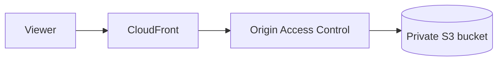

# AWS CDK Static Site

[][GitHub release]
[][Python support]
[][MIT License]
[][GitHub Actions CI workflow]

`aws-cdk-static-site` is a Python AWS CDK construct for deploying a static site through CloudFront
from a private, encrypted S3 bucket.

- [Getting Started](#getting-started)
- [At a Glance](#at-a-glance)
- [Release Status](#release-status)
- [Features](#features)
- [Architecture](#architecture)
- [Requirements](#requirements)
- [Installation](#installation)
- [Quickstart](#quickstart)
- [Design Boundaries](#design-boundaries)
- [Support AWS CDK Static Site](#support-aws-cdk-static-site)
- [PyPI Publication](#pypi-publication)
- [License](#license)
- [Contributing](#contributing)
- [Documentation](#documentation)
  - [User and API Documentation](#user-and-api-documentation)
  - [Community Health](#community-health)
  - [Maintainer Docs](#maintainer-docs)
- [Acknowledgments](#acknowledgments)

## Getting Started

To get started:

- Review the supported toolchain and AWS prerequisites in [Requirements](#requirements).
- Install a selected GitHub release as described in [Installation](#installation).
- Follow the [Quickstart](#quickstart) to compose the construct in a CDK stack.
- Choose a DNS and certificate model in the [configuration reference].
- Synthesize a focused [example][focused examples] before deploying resources.

## At a Glance

- Use CloudFront's generated hostname without configuring custom DNS.
- Import a `us-east-1` ACM certificate when DNS is managed outside Route 53.
- Create Route 53 aliases and a DNS-validated certificate when the stack owns DNS integration.
- Deploy local content with separate mutable and immutable cache metadata, or manage content
  outside the construct.
- Enable retained access logs and customize the Content Security Policy when required.

## Release Status

This pre-1.0 package has an evolving public API and is not yet published to PyPI. GitHub Releases
are the supported distribution and release-history surface during this phase.

## Features

- Private, encrypted, versioned S3 storage with Origin Access Control (OAC)
- CloudFront delivery using TLS 1.2, HTTP/2 and HTTP/3, compression, and IPv6
- Conservative HTML caching and opt-in immutable-asset deployment metadata
- Security headers with a configurable Content Security Policy
- Optional content deployment and CloudFront invalidation
- Optional Route 53 aliases and DNS-validated ACM certificate creation
- Support for externally managed DNS and an imported ACM certificate
- Optional access logs with bounded retention
- Retained content resources and low-cost `PriceClass_100` defaults

## Architecture



## Requirements

- Python 3.13 or 3.14 (`.python-version` selects Python 3.13 for compatible
  local version managers)
- AWS CDK v2
- An AWS account bootstrapped for CDK deployments
- An ACM certificate in `us-east-1` when using a custom CloudFront domain

## Installation

Until the package is published to PyPI, choose a tag from [GitHub Releases][GitHub release] and
replace `vMAJOR.MINOR.PATCH` below with that tag:

```bash
python -m pip install \
  "aws-cdk-static-site @ git+https://github.com/Dagitali/aws-cdk-static-site.git@vMAJOR.MINOR.PATCH"
```

For development, install from a local checkout with the development dependencies:

```bash
python -m pip install -e '.[dev]'
```

## Quickstart

```python
from aws_cdk import Stack
from aws_cdk import aws_certificatemanager as acm
from constructs import Construct

from aws_cdk_static_site import StaticSite
from aws_cdk_static_site import StaticSiteProps


class SiteStack(Stack):
    def __init__(self, scope: Construct, construct_id: str, **kwargs: object) -> None:
        super().__init__(scope, construct_id, **kwargs)

        certificate = acm.Certificate.from_certificate_arn(
            self,
            'Certificate',
            'arn:aws:acm:us-east-1:111111111111:certificate/example',
        )
        site = StaticSite(
            self,
            'Site',
            props=StaticSiteProps(
                site_content_path='site',
                domain_names=('www.example.com',),
                certificate=certificate,
            ),
        )
```

With external DNS, point the provider's CNAME for `www` at
`site.distribution.distribution_domain_name`. For Route 53, supply a hosted zone and set
`create_route53_records=True`. Set `create_certificate=True` to create a DNS-validated ACM
certificate in the consuming stack.

For content-addressed build output, set `immutable_asset_paths=("build/*",)` to deploy those files
with a long-lived `immutable` browser policy. Keep stable filenames out of this setting so browsers
can discover updates.

## Design Boundaries

This package provisions reusable site-delivery infrastructure. It intentionally
does not own:

- CDK app context or environment-variable parsing
- account-wide budgets
- a site's HTML, branding, analytics, or SEO
- contact forms or other application APIs
- GitHub OIDC roles and deployment workflows

Keeping those responsibilities in the consuming application avoids coupling a general construct to
one organization or deployment process.

## Support AWS CDK Static Site

If this construct saves you engineering time, consider supporting its maintenance through the
repository Sponsor button. Funding helps sustain:

- Maintenance, bug fixes, and security updates
- Compatibility work for new Python and AWS CDK releases
- Documentation, examples, testing, and release automation

The preferred sponsorship path is [GitHub Sponsors], with [Buy Me a Coffee] available for one-time
support. Funding is optional: documentation fixes, reproducible bug reports, usage feedback,
examples, and release testing are also valuable contributions.

Use the [support policy] for public help channels and the [security policy] for private vulnerability
reporting.

## PyPI Publication

PyPI does not require novelty, but a useful and stable API, clear documentation, maintenance intent,
and an available project name matter. Before publishing, validate the package with `dagitali.com`
and at least one additional site, complete the public API review, and configure reviewed trusted
publishing. Until then, the tag-triggered workflow validates downloadable distributions and
Git-based installation remains supported.

## License

This project is licensed under the [MIT License].

## Contributing

Code and codeless contributions are welcome. See the [contributing guidelines] for development,
testing, documentation, and pull-request expectations.

## Documentation

### User and API Documentation

- [Documentation index]: Guide scope and local documentation build commands
- [Configuration reference]: Construct properties, validation rules, and supported integrations
- [Cost considerations]: AWS cost drivers, defaults, and consumer responsibilities
- [Focused examples]: Runnable composition patterns for supported configurations
- [Local Sphinx documentation]: Generated API documentation and local build instructions
- [Technical references]: Authoritative sources for AWS, Python, packaging, and automation

### Community Health

- [Contributing guidelines]: Development workflow, quality gates, and pull-request expectations
- [Code of Conduct]: Community standards and enforcement
- [Security policy]: Private vulnerability reporting and response expectations
- [Support policy]: Supported surfaces, help channels, and maintenance expectations

### Maintainer Docs

- [Testing guide]: Test layers, dependency boundaries, coverage, and local commands
- [Disposable AWS deployment testing]: Guardrails for the manual create-and-destroy workflow
- [Extraction roadmap]: Consumer integration, generality validation, and publication planning
- [CI/CD workflow map]: Workflow triggers, responsibilities, and required checks
- [Changelog]: Versioned release history
- [Release policy]: Versioning, compatibility, artifacts, and support expectations
- [Release checklist]: Preparation, validation, tagging, publication, and closeout steps
- [Maintainer runbooks]: Protected-branch, release, hotfix, recovery, and cleanup procedures

## Acknowledgments

This project began as the reusable delivery layer behind the [Dagitali website]. It complements
application templates: a template creates a repository, while this package supplies a maintained CDK
construct that applications can compose inside their own stacks. Feedback and contributions are
welcome.

[Buy Me a Coffee]: https://buymeacoffee.com/djrlj694
[Changelog]: CHANGELOG.md
[CI/CD workflow map]: CI-CD-WORKFLOWS.md
[Code of Conduct]: CODE_OF_CONDUCT.md
[Configuration reference]: docs/CONFIGURATION.md
[Contributing guidelines]: CONTRIBUTING.md
[Cost considerations]: docs/COSTS.md
[Dagitali website]: https://www.dagitali.com/
[Disposable AWS deployment testing]: docs/DEPLOYMENT-TESTING.md
[Documentation index]: docs/README.md
[Extraction roadmap]: docs/ROADMAP.md
[Focused examples]: examples/README.md
[GitHub Actions CI workflow]: https://github.com/Dagitali/aws-cdk-static-site/actions/workflows/ci.yml
[GitHub release]: https://github.com/Dagitali/aws-cdk-static-site/releases
[GitHub Sponsors]: https://github.com/sponsors/Dagitali
[Local Sphinx documentation]: docs/README.md#build-the-local-site
[Maintainer runbooks]: .github/MAINTAINER-RUNBOOKS.md
[MIT License]: LICENSE
[Python support]: #requirements
[Release checklist]: RELEASE-CHECKLIST.md
[Release policy]: RELEASE-POLICY.md
[Security policy]: SECURITY.md
[Support policy]: SUPPORT.md
[Technical references]: REFERENCES.md
[Testing guide]: docs/TESTING.md
