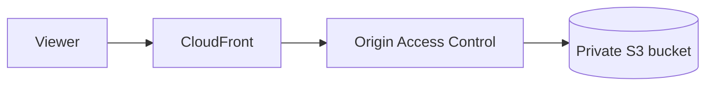

# AWS CDK Static Site

[][GitHub release]
[][Python support]
[](LICENSE)
[][GitHub Actions CI workflow]

`aws-cdk-static-site` is a Python AWS CDK construct for deploying a static site through CloudFront
from a private, encrypted S3 bucket.

The project began as the reusable delivery layer behind [dagitali.com](https://www.dagitali.com/).
It complements application templates: a template creates a repository, while this package supplies a
maintained CDK construct that applications can compose inside their own stacks.

- [Status](#status)
- [Features](#features)
- [Architecture](#architecture)
- [Requirements](#requirements)
- [Installation](#installation)
- [Usage](#usage)
- [Design Boundaries](#design-boundaries)
- [Documentation](#documentation)
- [Contributing and Support](#contributing-and-support)
- [PyPI Publication](#pypi-publication)
- [License](#license)

## Status

This repository is an early extraction. Its public API may change before version 1.0.0, and it is
not yet published to PyPI.

## Features

- Private, encrypted, versioned S3 storage with Origin Access Control (OAC)
- CloudFront delivery using TLS 1.2, HTTP/2 and HTTP/3, compression, and IPv6
- Conservative HTML caching and opt-in immutable-asset deployment metadata
- Security headers with a configurable Content Security Policy
- Optional content deployment and CloudFront invalidation
- Optional Route 53 aliases and DNS-validated ACM certificate creation
- Support for externally managed DNS and an imported ACM certificate
- Optional access logs with bounded retention
- Retained content resources and low-cost `PriceClass_100` defaults

## Architecture



## Requirements

- Python 3.13 or 3.14 (`.python-version` selects Python 3.13 for compatible
  local version managers)
- AWS CDK v2
- An AWS account bootstrapped for CDK deployments
- An ACM certificate in `us-east-1` when using a custom CloudFront domain

## Installation

Until the package is published to PyPI, install a selected GitHub release tag:

```bash
python -m pip install \
  "aws-cdk-static-site @ git+https://github.com/Dagitali/aws-cdk-static-site.git@v0.2.0"
```

For development, install from a local checkout with the development dependencies:

```bash
python -m pip install -e '.[dev]'
```

## Usage

```python
from aws_cdk import Stack
from aws_cdk import aws_certificatemanager as acm
from constructs import Construct

from aws_cdk_static_site import StaticSite
from aws_cdk_static_site import StaticSiteProps


class SiteStack(Stack):
    def __init__(self, scope: Construct, construct_id: str, **kwargs: object) -> None:
        super().__init__(scope, construct_id, **kwargs)

        certificate = acm.Certificate.from_certificate_arn(
            self,
            "Certificate",
            "arn:aws:acm:us-east-1:111111111111:certificate/example",
        )
        StaticSite(
            self,
            "Site",
            props=StaticSiteProps(
                site_content_path="site",
                domain_names=("www.example.com",),
                certificate=certificate,
            ),
        )
```

With external DNS, point the provider's CNAME for `www` at
`site.distribution.distribution_domain_name`. For Route 53, supply a hosted zone and set
`create_route53_records=True`. Set `create_certificate=True` to create a DNS-validated ACM
certificate in the consuming stack.

For content-addressed build output, set `immutable_asset_paths=("build/*",)` to deploy those files
with a long-lived `immutable` browser policy. Keep stable filenames out of this setting so browsers
can discover updates.

## Design Boundaries

This package provisions reusable site-delivery infrastructure. It intentionally
does not own:

- CDK app context or environment-variable parsing
- account-wide budgets
- a site's HTML, branding, analytics, or SEO
- contact forms or other application APIs
- GitHub OIDC roles and deployment workflows

Keeping those responsibilities in the consuming application avoids coupling a general construct to
one organization or deployment process.

## Documentation

- [Documentation index](docs/README.md)
- [Configuration reference](docs/CONFIGURATION.md)
- [Cost considerations](docs/COSTS.md)
- [Testing guide](docs/TESTING.md)
- [Extraction roadmap](docs/ROADMAP.md)
- [CI/CD workflow map](CI-CD-WORKFLOWS.md)
- [Release policy](RELEASE-POLICY.md)
- [Release checklist](RELEASE-CHECKLIST.md)
- [Maintainer runbooks](.github/MAINTAINER-RUNBOOKS.md)

## Contributing and Support

See [CONTRIBUTING.md](CONTRIBUTING.md) for development and pull-request expectations. Use
[SUPPORT.md](SUPPORT.md) for public help channels and [SECURITY.md](SECURITY.md) for private
vulnerability reporting.

## PyPI Publication

Novelty is not a PyPI requirement, but usefulness, a stable API, documentation, maintenance intent,
and a non-conflicting project name matter. Before publishing, this project should be consumed by
`dagitali.com` and at least one second site, complete its public API review, and automate build,
wheel smoke testing, and trusted publishing. Git-based installation is sufficient during extraction.

## License

Licensed under the [MIT License](LICENSE).

[GitHub Actions CI workflow]: https://github.com/Dagitali/aws-cdk-static-site/actions/workflows/ci.yml
[GitHub release]: https://github.com/Dagitali/aws-cdk-static-site/releases
[Python support]: #requirements
